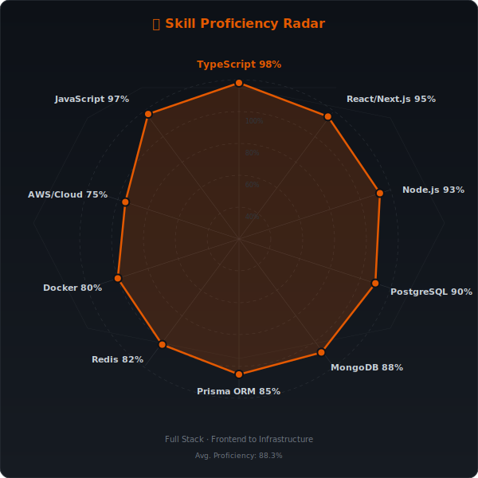
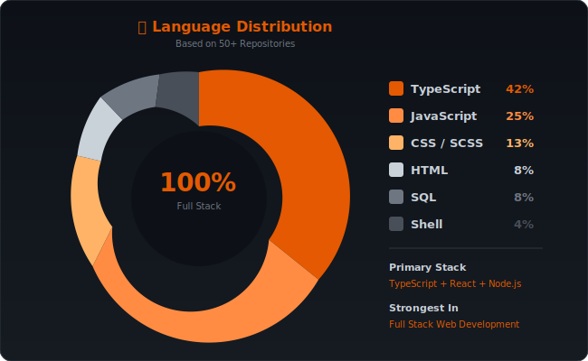
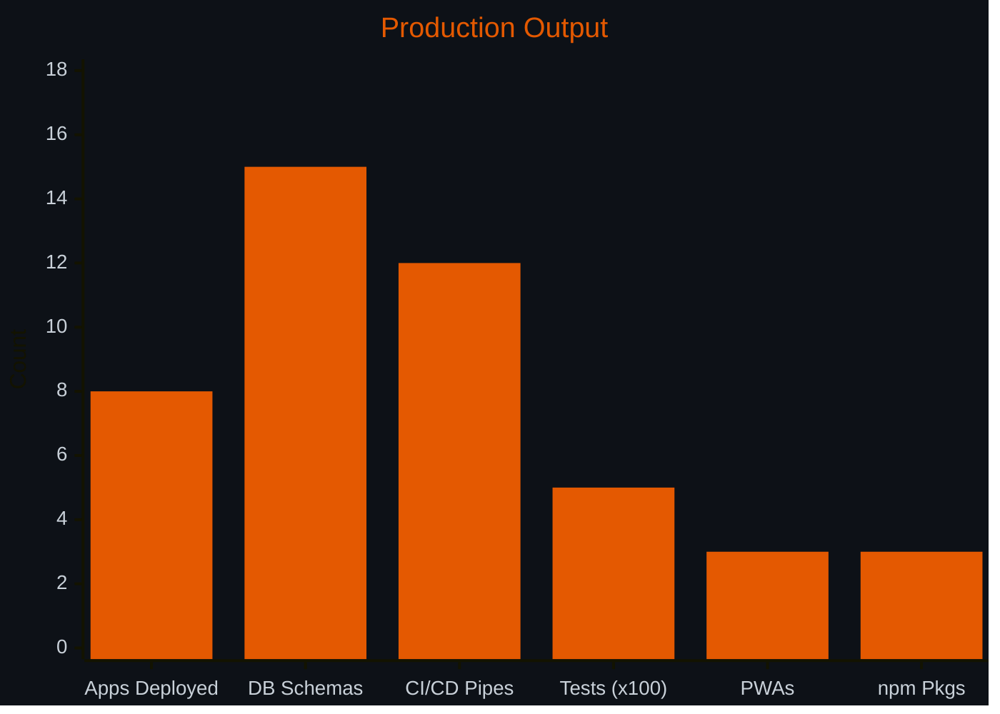

<div align="center">

```
.___  ___.      ___      .__   __.  __   _______     _______. __    __  
|   \/   |     /   \     |  \ |  | |  | |   ____|   /       ||  |  |  | 
|  \  /  |    /  ^  \    |   \|  | |  | |  |__     |   (----`|  |__|  | 
|  |\/|  |   /  /_\  \   |  . `  | |  | |   __|     \   \    |   __   | 
|  |  |  |  /  _____  \  |  |\   | |  | |  |____.----)   |   |  |  |  | 
|__|  |__| /__/     \__\ |__| \__| |__| |_______|_______/    |__|  |__| 
                                                                         
                                                                                  
```

### Creative · Designer · Developer

[](https://git.io/typing-svg)

[](https://manieshsanwal.in)
<!-- [](https://kraaft.manieshsanwal.in) -->

</div>

---

## ⚡ About Me

```typescript
const maniesh: Full Stack Developer = {
  name:      "Maniesh Sanwal",
  role:      "Full Stack Developer",
  location:  "India 🇮🇳",
  portfolio: "https://manieshsanwal.in",

  frontend:  ["React", "Next.js", "TypeScript", ],
  backend:   ["Node.js", "Express", "Prisma ORM", "react-hook-form", "NextAuth.js"],
  databases: ["PostgreSQL", "MySQL", "MongoDB"],
  cache:     ["Redis", "Upstash"],
  payments:  ["Razorpay", "Stripe"],
  infra:     ["Railway", "Vercel", "Neon PostgreSQL", "Railway"],
  tools:     {["Git", "VS Code", "Postman", "Figma", "Docker", "AWS", "Azure", "Heroku", "Netlify", "Vercel"]
              ["Cloudflare", "Firebase", "MongoDB Atlas", "Supabase", "PostgreSQL", "MySQL", "Redis", "React PWA"]
              [ "Shadcn UI", "Framer Motion", "SCSS", "Tailwind CSS", "Vite", "redux", "redux toolkit", "react-query"]
              ["zustand", "react-hook-form"]}
  

  openTo:            "Full-time · Freelance · Collaborations",
};
```

---

## 🛠️ Tech Stack

### Frontend


### Backend


### Databases & Cache


### Infra & Payments


### Tools


---

## 🚀 Featured Projects

### 🔧 [Kraaft — 300+ Free Online Tools](https://kraaft.manieshsanwal.in)
> Your one-stop destination for 300+ free online tools. No login required. Fast, private, and built for everyone.
> Let me be honest — I built this because I was frustrated.
> Every time I needed a quick tool — compress a PDF… resize an image… format some JSON… check my GST… I'd land on some sketchy website full of ads, popups, and "please create an account to continue."
> So I built the solution myself. 👇
- PDF Tools
- Image Tools
- Developer Tools
- Security Tools
- Video Tools
- Audio Tools
- Math Tools
- Unit Converters
- Text Tools
- Design Tools
- Cryptocurrency Tools
- Coding Tools
- Internet Tools
- Color Tools
- Accessibility Tools
- Productivity Tools
- And many more...

✅ 100% Free — forever 
✅ No login required 
✅ Privacy-first — runs in your browser 
✅ Already used by 10,000+ creators, devs & marketers
And now — it's open source. 🎉


**[→ Live](https://kraaft.manieshsanwal.in)**

---

### 🥊 [FightClub](https://fightclub.manieshsanwal.in)
> 𝗟𝗮𝗻𝗴𝘂𝗮𝗴𝗲𝘀 -> JavaScript · TypeScript · HTML5 · CSS3
> 𝗙𝗿𝗼𝗻𝘁𝗲𝗻𝗱 -> React.js · Next.js · Tailwind CSS · Framer Motion · GSAP · Three.js · Shadcn UI · Sass
> 𝗕𝗮𝗰𝗸𝗲𝗻𝗱 -> Node.js · Express.js · Next.js API Routes · REST API · JWT Auth · RBAC
> 𝗗𝗮𝘁𝗮𝗯𝗮𝘀𝗲 -> PostgreSQL · MongoDB · Prisma ORM · Redis · Supabase · Firebase
> 𝗜𝗻𝗳𝗿𝗮 -> Railway · Neon DB · Cloudflare · Redis · Railway
> 𝗗𝗲𝘃𝗢𝗽𝘀 & 𝗧𝗼𝗼𝗹𝘀 -> Git · GitHub · Vercel · Netlify · Docker (basic) · Postman · VS Code · Figma
> 𝗗𝗲𝘀𝗶𝗴𝗻 -> Figma · UI/UX Design · Responsive Design · Web Animations


**[→ Live](https://fightclub.manieshsanwal.in)**

---

### 🏪 Retail POS System *(In Progress)*
> 𝗙𝗿𝗼𝗻𝘁𝗲𝗻𝗱 → React 18 + Vite PWA + Nextjs for manager dashboard 
Offline-first with Dexie.js (IndexedDB) for the cashier terminal. Each role gets its own route tree — cashier, dept manager, store manager, admin never share the same UI shell.

> 𝗕𝗮𝗰𝗸𝗲𝗻𝗱 → Node.js + Express + TypeScript
Stateless JWT auth carrying role, permissions, shiftId, and terminalId. Every route gated by a requirePermission() middleware — not just a role check, but a granular action string like pos:void or reports:view.

> 𝗗𝗮𝘁𝗮𝗯𝗮𝘀𝗲 → PostgreSQL 16 + Redis
Row-Level Security at the DB layer means a department manager literally cannot query another dept's rows — even if there's a bug in app code. Redis handles caching, pub/sub stock broadcasts, and BullMQ job queues.

> 𝗜𝗻𝗳𝗿𝗮 → Vercel · Railway · Neon DB · Redis · Cloudflare Images

𝗥𝗕𝗔𝗖 𝗮𝘁 𝗲𝘃𝗲𝗿𝘆 𝗹𝗮𝘆𝗲𝗿:
→ JWT permissions in the token
→ requirePermission() on every API route
→ RLS policies in PostgreSQL
→ Role-scoped cache keys in Redis
→ Append-only audit log for every void, discount & override


---

### 🌐 [Portfolio Website](https://manieshsanwal.in)
> Personal portfolio — UI/UX Designer + Full Stack Developer. Built with Next.js, featuring smooth animations and a bold creative aesthetic.


**[→ Live](https://manieshsanwal.in)**

---

## 📊 GitHub Stats & Activity

<!-- Key Metrics Badges -->
<div align="center">


</div>

<br/>

<!-- Yearly Contributions Bar Chart -->
<div align="center">

### 📈 Yearly Contribution Growth



</div>

<br/>

<!-- Skill Proficiency Radar Chart -->
<div align="center">

### 🎯 Skill Proficiency



</div>

<br/>

<!-- Language Distribution Donut Chart -->
<div align="center">

### 💻 Language Distribution



</div>

<br/>

<!-- Coding Metrics Bar Chart (Mermaid) -->
<div align="center">

### ⚡ What I Ship



</div>

<br/>

<!-- Streak & Consistency -->
<div align="center">


</div>

---

## 💼 Open to Opportunities

<div align="center">

> 🚀 **Full Stack Developer** actively looking for **Full-time**, **Freelance**, and **Collaboration** opportunities.
>
> I build production-grade web applications with **React**, **Next.js**, **Node.js**, **TypeScript**, and **PostgreSQL**.
>
> If you're looking for a developer who ships fast and builds to last — **let's talk.**

<br/>

[](mailto:manieshsanwal.dev@gmail.com)
[](https://manieshsanwal.in)
[](https://linkedin.com/in/maniesh-sanwal)
[](https://github.com/Maniesh-dev)
[](mailto:[EMAIL_ADDRESS])

</div>

---

<div align="center">
  
  
  <br/><br/>

  **"Design it. Build it. Ship it."**
  
  <sub>⭐ If you like my work, consider giving my repos a star — it means a lot!</sub>
</div>
